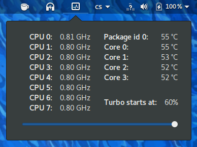

Indicator for Intel CPU - GNOME Shell Extension
===============================================

About
-----

  * This GNOME Shell extension shows the frequency and temperature of Intel CPUs with `intel_pstate` driver.
  * The data is updated only if the menu is shown

Dependencies
------------

  * Build dependencies:
      - GNU Make
      - [JavaScript Standard Style checker](https://standardjs.com/)
  * Runtime dependencies:
      - GNOME Shell >= 3.26
      - `sensors` command

Installation
------------

  * `make install` installs to `/usr/local/share/gnome-shell/extensions`
  * `make PREFIX=~/.local install` installs to  `~/.local/share/gnome-shell/extensions`
  * `make DESTDIR=./tmp PREFIX=/usr install` installs to `./tmp/usr/share/gnome-shell/extensions`

Development
-----------

  * Use [JavaScript Standard Code Style](https://standardjs.com/).
  * Use `make fix` to reformat the code and show code style errors.

Copyright
---------

  * Copyright 2018 Jiří Janoušek <janousek.jiri@gmail.com>
  * Licensed under BSD-2-Clause - see the [LICENSE file](./LICENSE).
